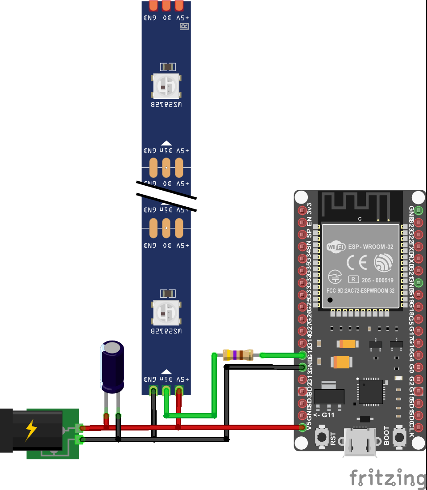
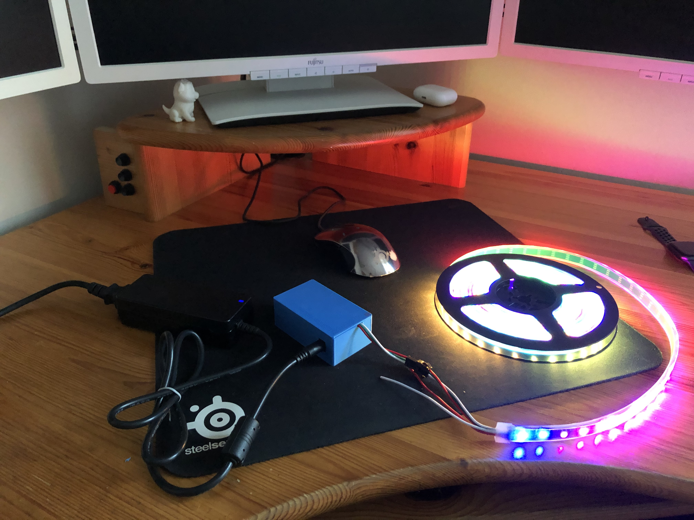

# ESP32-UDP-ledController
Control some WS2812b Leds with an esp-32 microcontroller via udp datagrams.

## Requirements

- 5V adapter (60 mA / led)
- 1000 uF capacitor
- 220 ohm resistor

## layout

# usage

1. Change your wireless ap settings.
2. Write Code on your board.
3. Server will start on specific port.
4. Use your client app to send UDP packets, follow these packet rules:

# Packet rules

use hexa values

<table>
<tr>
    <td>1-2</td>
    <td>Priority</td>
</tr>
<tr>
    <td>3-5</td>
    <td>number of leds</td>
</tr>
<tr>
    <td>6-8</td>
    <td>brightness</td>
</tr>
<tr>
    <td>8+</td>
    <td>one led color</td>
</tr>
</table>

